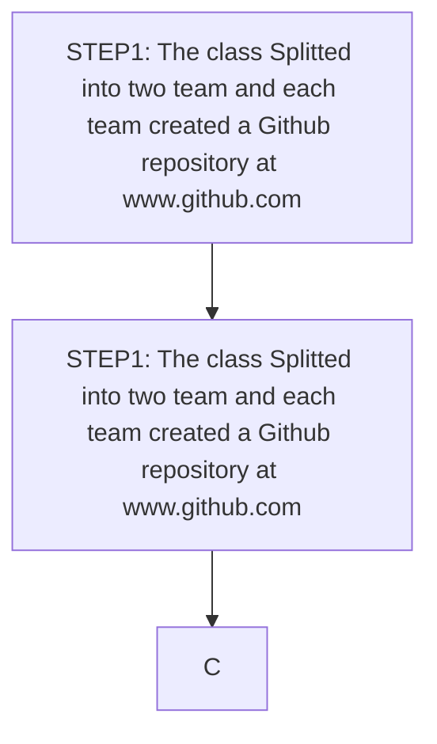

# GSU GROUP A
## ABOUT 
This is a repository for the work assigned to Group A Gombe State University. It is a collaborative group assignment from all the members. This READ.ME file contains information about the names of the members of this group. Each a group member used a unique programing language. All members are required to add their names, registration numbers, email address, programming language used, bioinformatics sub-specialty and slack username. 
## GROUP A MEMBERS 
Names of group members includes:
1. Dalbadal Paul Amana
2. Dahiru Okashatu Ismail
3. Hickson Clinton Eyyammeh
## PROGRAMMING LANGUAGE
* The Language used by each group member is as follows.

| S/N    | Name                              | Matriculation Number    | Programming Lang |
|--------|-----------------------------------|-------------------------|------------------|
|   1    | Dalbadal Paul Amana               | UG17/MDHA/1009          |                  |
|   2    | Dahiru Okashatu Ismail            | UG17/MDHA/1008          | Java Script&HTML |
|   3    | Hickson Clinton Eyyammeh          | UG17/MDHA/1005          | Python           |

# Workflow

